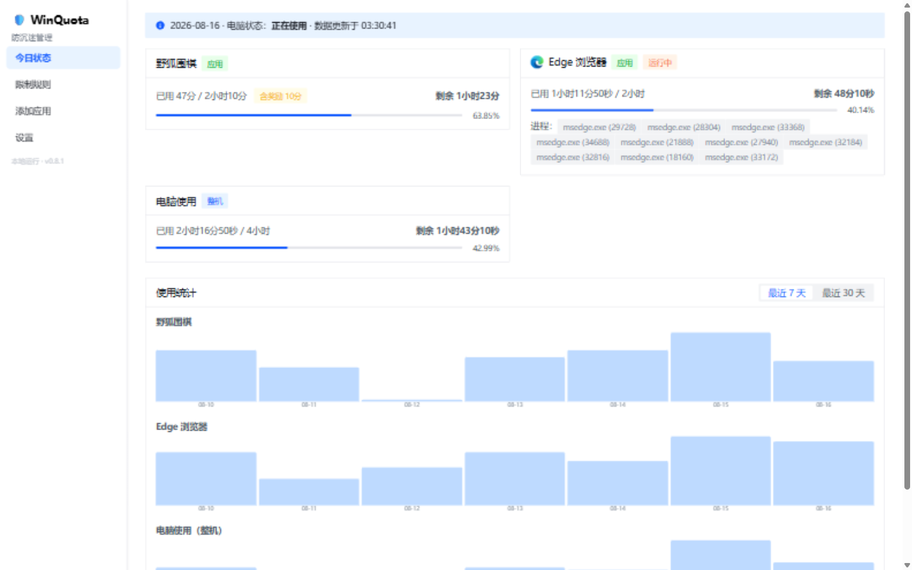
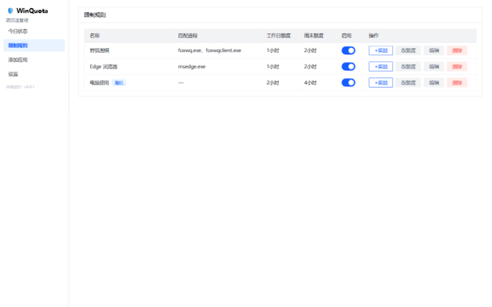
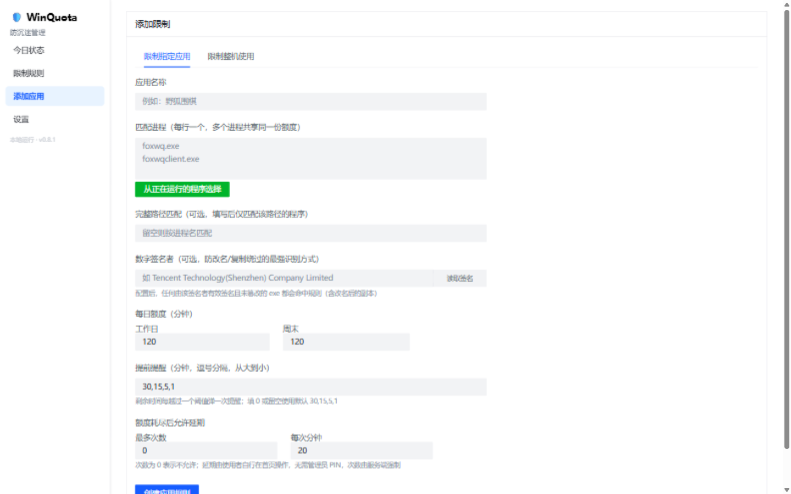
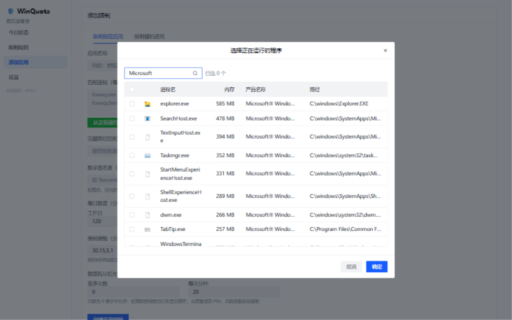
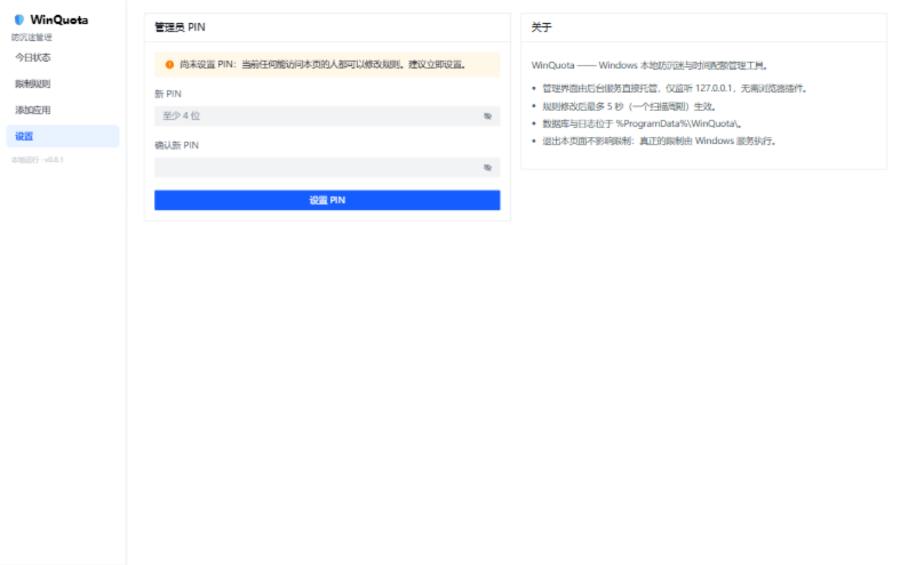

<div align="center">

# ⏳ WinQuota

**给 Windows 上一把「时间锁」—— 本地防沉迷与时间配额管理**

为指定游戏 / 应用或整台电脑设置每日使用额度：到点提醒、耗尽关闭、次日自动恢复。

Windows 10 / 11 · 后台服务常驻 · 纯本地运行，无需联网、无账号、无广告


</div>

---

## 🎯 它能解决什么问题？

孩子放学回家打开游戏就是一下午？自己也总忍不住“再刷十分钟”？

WinQuota 以 **Windows 后台服务** 方式静默运行，按你定下的规则分配每日时间额度：**提前提醒 → 额度耗尽自动关闭程序（或锁定电脑）→ 第二天自动恢复**。规则由管理员掌握，用 PIN 保护修改；所有数据只存在本机。

## ✨ 核心特性

### 限额与提醒

- 🎮 **应用限额**：按进程名 / 完整路径 / 产品名 / 数字签名者识别目标程序，一个应用组（如游戏的多进程）共享一份额度
- 🖥️ **整机限额**：限制每天使用电脑的总时长，锁屏、空闲、睡眠不计入，耗尽自动锁定
- 📅 **工作日 / 周末差异化**：周一到周五 1 小时、周末 2 小时，随意组合
- ⏰ **提前提醒**：剩余时间越过一个阈值（默认 30 / 15 / 5 / 1 分钟，可按规则配置）弹一次 Toast
- 🎁 **临时奖励**：今天表现好？管理员随时追加 15 / 30 / 60 分钟，次日自动失效
- ⏳ **自助延期**：耗尽后进入宽限期（默认 5 分钟，不杀进程不锁屏），使用者可自行有限次延期——把“再玩 20 分钟”变成一次明确的、有次数上限的决定，无需找家长输 PIN

### 防绕过（防的是家里的“小聪明”）

- 🔏 **改名也没用**：产品级识别（ProductName / Publisher）+ 数字签名校验（WinVerifyTrust），exe 改名、复制、换目录后依然命中
- 🌳 **进程树管控**：命中进程纳入 Job Object，派生的子进程（含改名子进程）自动继承，耗尽时整棵树一次终止
- 🕐 **时钟防回拨**：改系统时间重置额度？7 天以内的回拨按原日期继续累计
- 🔐 **数据库防篡改**：全量 HMAC 签名 + 单调序号防文件回滚 + 运行时用量单调保护；检测到篡改即冻结数据并持续按最近合法规则执行限制
- ♻️ **服务自恢复**：SCM 故障重启策略 + 服务 / 数据目录双 ACL 加固，`sc stop` 对受限用户失效

### 使用体验

- 🌐 **Web 管理界面**：服务直接托管，浏览器打开即用（仅监听 127.0.0.1，敏感操作 PIN 鉴权）
- 📊 **实时状态与统计**：剩余时间进度条、运行中进程、最近 7 / 30 天使用统计图
- 🖲️ **托盘程序**：原生窗口内嵌管理界面，悬停即见剩余时间，支持一键锁定 / 开机自启
- 🔌 **纯本地**：不联网、不上报、无账号，数据库就在 `%ProgramData%\WinQuota\`

## 🖼️ 界面一览

### 今日状态 —— 剩余时间、运行中进程与使用统计



### 限制规则 —— 启用开关、额度调整、临时奖励



### 添加应用 —— 从正在运行的程序一键选择，支持签名者识别



### 进程选择器 —— 图标 / 产品名 / 路径一目了然，支持过滤



### 设置 —— 管理员 PIN 保护规则修改



> 截图来自演示环境，数据为演示数据。

## 🚀 快速开始

从源码构建安装包（需要 .NET 10 SDK、Node.js 与 NSIS）：

```bash
git clone https://github.com/HatcherZhao/WinQuota.git
cd WinQuota

# 1. 构建前端
cd src/WinQuota.Web && npm install && npm run build && cd ../..

# 2. 发布服务与托盘（自包含单文件，目标机器无需安装 .NET）
dotnet publish src/WinQuota.Service -c Release -r win-x64 --self-contained true -p:PublishSingleFile=true -p:IncludeNativeLibrariesForSelfExtract=true -p:EnableCompressionInSingleFile=true -o publish/service
dotnet publish src/WinQuota.Tray -c Release -r win-x64 --self-contained true -p:PublishSingleFile=true -p:IncludeNativeLibrariesForSelfExtract=true -p:EnableCompressionInSingleFile=true -o publish/tray

# 3. 打包安装程序
cd tools && makensis installer.nsi
# 产物：dist/WinQuota-Setup-<版本>.exe
```

安装后服务自动注册并配置故障自恢复；打开 `http://127.0.0.1:58390/` 或托盘程序即可配置规则。**建议装好后立即在「设置」页配置管理员 PIN，并确保被限制用户使用标准账户。**

完整安装与部署方式（含脚本安装、服务配置、全部配置项）见 [docs/installation.md](docs/installation.md)。

## 📖 文档

| 文档 | 内容 |
| --- | --- |
| [使用指南](docs/usage.md) | 管理界面四页面、托盘程序、PIN 与延期语义、耗尽流程 |
| [安装与部署](docs/installation.md) | 构建、打包安装程序、服务部署、数据目录与配置项 |
| [CLI 参考](docs/cli.md) | 规则 / 用量 / 奖励 / PIN 管理命令与诊断命令 |
| [架构与设计](docs/architecture.md) | 系统架构、关键设计决策、防绕过与防篡改细节、开发状态 |
| [实施计划](docs/implementation-plan.md) | 项目原始需求背景与分阶段规划 |

## 🧱 技术栈

| 层 | 技术 |
| --- | --- |
| 后台服务 | .NET 10（WebApplication + Worker Service），SQLite（WAL），纯 Win32 API |
| 管理界面 | Vue 3 + TypeScript + Vite + Arco Design，由服务进程直接托管 |
| 桌面程序 | WinForms + WebView2 |
| 安装器 | NSIS |

## ⚠️ 已知边界

对拥有**本地管理员权限**或可物理接触机器的使用者，任何本地防护都只能提高门槛、无法根绝——请确保被限制用户使用标准账户。Windows 系统自带程序多为目录签名（catalog），签名者匹配不适用于它们；游戏与第三方软件通常为内嵌签名，可正常使用该特性。
